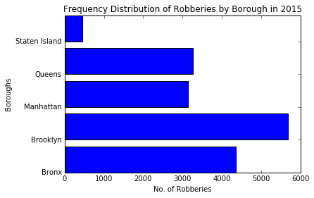
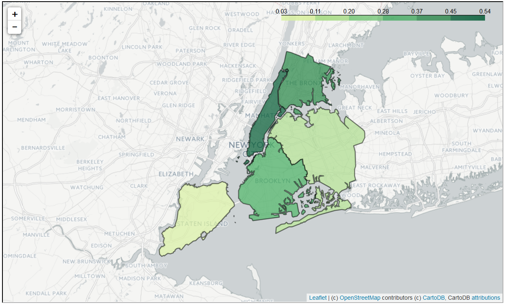

# Exploring geospatial in-database analytics with IBM dashDB and iPython notebooks using ibmdbpy


Traditional approaches to data analysis require data to be moved out of the database or files into a separate
analytics environment for processing, and then back to the database or files, which is an expensive process.
Doing the analysis in a database, where the data resides, eliminates the costs, time and security
issues associated with the old approach by doing the processing in the data warehouse itself.

We have used the Python package [ibmdbpy](https://github.com/ibmdbanalytics/ibmdbpyhttps://github.com/ibmdbanalytics/ibmdbpy)
 to enable the process of in-database analytics with dashDB
and use it in Pandas-like syntax from Interactive Python notebooks.
The ibmdbpy package translates Pandas-like syntax into SQL and uses a middleware API
(pypyodbc/JayDeBeApi) to send it to an ODBC or JDBC-connected database for execution.
These SQL statements are translated to database queries at runtime as SQL pushdowns. 
The result is retrieved as a memory instance in the form of dataframes, which are
easy to manipulate for further exploratory analysis. It reduces execution time for reading
data and running complex queries on the data compared to fetching the entire dataset into
memory. It, therefore, avoids network overload and crashing of the notebook due to missing local memory.


## Getting started

Here we describe a simple example on how to use ibmdbpy with dashDB from notebooks especially with geospatial data.

1. Create a [Bluemix account.](http://www.ibm.com/developerworks/cloud/library/cl-bluemix-fundamentals-start-your-free-trial/)

2. Launch a new Jupyter notebook from the [apache spark service.](https://console.ng.bluemix.net/docs/services/AnalyticsforApacheSpark/index.html)

3. Import the package ibmdbpy ( If not installed, install it from pypi using this url : )

TODO: add the import statement and link

4. The first step is to setup a connection with the data source, which is dashDB in our case.
   It can be done in two ways either with jdbc (For Linux and MAc users) or with odbc (For Windows users)

   In order to setup an ODBC connection (say 'DASHDB'), the connection parameters from dashDB can be used along
   with the login credentials and then follow the below steps:

```python
import ibmdbpy
from ibmdbpy import IdaDataBase
idadb = IdaDataBase('DASHDB')
```


   That' all you have to do!

   FIXME: I dont think the following is required on Bluemix, right? If not, then we need the commands to set it up
   For setting up a JDBC connection, please make sure an existing Java runtime environment is setup and the
   db2jcc.jar file is available in the classpath and an additonal python library jaydebeapi needs to be installed.


   Once everything is in place, we can just do the following

```python
import ibmdbpy, jaydebeapi
from ibmdbpy import IdaDataBase
username = raw_input("Enter user name (default is 'showcase'):") or "showcase"
password = getpass.getpass("Enter password:")
idadb = IdaDataBase(jdbc)
```

FIXME: what is this small example actually about? we should at least do some ipbdbpy operation...
FIXME: I think we need a bit more on how ibmdbpy actually works, some more examples with explanations would do it.

## Usecase New York crime analysis

Let us now try out a use case for using this package to analyze crimes committed in the city of New York.
The New York city police department has gathered a huge amount of data over a period
of 10 years and more and categorized the7major crime types (felonies) committed in the city of New York.

The dataset is available in NYC Open Data provided by New York City police department and can be downloaded
[here.](https://data.cityofnewyork.us/Public-Safety/NYPD-7-Major-Felony-Incidents/hyij-8hr7/data)
We can analyze this huge dataset efficiently with `ibmdbpy` to gain meaningful insights from
the data. The major crime hotspots can be then visualized with the help of `folium` and `matplotlib`.

0. TODO: briefly describe loading data into dashdb...

More details on loading geospatial data into dashDB can be found
[here](https://www.ibm.com/support/knowledgecenter/SS6NHC/com.ibm.swg.im.dashdb.doc/learn_how/loaddata_gsdata.html).

The NYC crime data is now available on dashDB. Let's take a look at the data in dashDB:

```python
from IPython.display import IFrame
IFrame("https://dashdb-entry-yp-dal09-07.services.dal.bluemix.net:8443/", width=950, height=450)
```


The crime data is already geo-coded (TODO: explain why?) and stored as ST_Point in dashDB. Along with it additional geospatial data for
defining the New York city boroughs are also loaded in dashDB, which will be used for further analysis.


1. To enable our analysis let's first load all required libraries into our notebook:

FIXME: does not work in bluemix - correct ibmdbpy library?

```python
# Import packages needed for analysis
import ibmdbpy
from ibmdbpy import IdaDataFrame, IdaDataBase, IdaGeoDataFrame
import matplotlib as mpl
import folium,ggplot,mplleaflet
import matplotlib.pyplot as plt
%matplotlib inline
print('All libraries imported!')
```

    All libraries imported!


2. Let us now connect to our dashDB datasource with a JDBC connection.


```python
import getpass,jaydebeapi,jpype
uid = raw_input('Enter Username:')
pwd = getpass.getpass('Enter password:')
jdbc = 'jdbc:db2://dashdb-entry-yp-dal09-07.services.dal.bluemix.net:50000/BLUDB:user=' + uid + ';password=' + pwd
idadb = IdaDataBase(dsn = jdbc)
print('Connection to dashDB successful!')
```

    Enter Username:dash5548
    Enter password:········
    Connection to dashDB successful!


3. The crime data is retrieved as an `IdaGeoDataFrame` which is similar to a `pandas` data frame. 
The process of data retrieval and spatial analysis is much faster with `ibmdbpy` when compared to some well know
spatial analysis libraries like `shapely` and `geopandas`, which usually performs pairwise geometric operations
between two different geometries. 
FIXME: Dont understand this...

Some users might want to use a more Python-like
syntax to perform the same exploratory analysis using IdaGeoDataFrames from __ibmdbpy-spatial extension__ .


FIXME: dont think we need the time here, because we dont compare to geopandas. 
Alternatively you can do one analysis in geopandas first, then we can compare the times.


```python
import numpy as np
%time nyc_crime_geo  = IdaGeoDataFrame(idadb,'NYC_CRIME_DATA',indexer = 'OBJECTID')
%time robberies_2015 = nyc_crime_geo[nyc_crime_geo['Offense']=='ROBBERY']
%time robberies_2015 = robberies_2015[robberies_2015['Occrr_Y'] == 2015]
%time robberies2015_brooklyn  = len(robberies_2015[robberies_2015['Borough']=='BROOKLYN'])
%time robberies2015_bronx     = len(robberies_2015[robberies_2015['Borough']=='BRONX'])
%time robberies2015_manhattan = len(robberies_2015[robberies_2015['Borough']=='MANHATTAN'])
%time robberies2015_queens    = len(robberies_2015[robberies_2015['Borough']=='QUEENS'])
%time robberies2015_staten    = len(robberies_2015[robberies_2015['Borough']=='STATEN ISLAND'])
%time robberies_count = [robberies2015_bronx,robberies2015_brooklyn,robberies2015_manhattan,
                         robberies2015_queens,robberies2015_staten]
x = np.array([0,1,2,3,4])
y = np.array(robberies_count)
my_yticks = ['Bronx','Brooklyn','Manhattan','Queens','Staten Island']
plt.yticks(x, my_yticks)
%time plt.barh(x, y)
plt.title('Frequency Distribution of Robberies by Borough in 2015')
plt.xlabel('No. of Robberies')
plt.ylabel('Boroughs')
```

    Wall time: 302 ms
    Wall time: 1.89 s
    Wall time: 624 ms
    Wall time: 1.45 s
    Wall time: 1.45 s
    Wall time: 1.45 s
    Wall time: 1.42 s
    Wall time: 1.42 s
    Wall time: 0 ns
    Wall time: 4 ms


    <matplotlib.text.Text at 0xf577f390>





4. We can further analyze the spatial distribution of crimes over a period of past
decade as a scatterplot .

```python
idadf = IdaGeoDataFrame(idadb,'NYC_CRIME_DATA',indexer = 'OBJECTID',geometry = 'GEO_DATA')
idadf = idadf[idadf['Occrr_Y'] == 2015]
idadf= idadf[idadf['Offense'] == "BURGLARY"]
idadf['X'] = idadf.x() # Using the spatial function ST_X and ST_Y to extract the coordinates
idadf['Y'] = idadf.y()
df = idadf[['Identfr','Occrrnc_Dt','Offense','Precnct','Borough','X','Y']].as_dataframe()
df.plot(kind='scatter', x='X', y='Y', title = 'Spatial Distribution of Burglaries in 2015', figsize=[10,7])
```


    <matplotlib.axes._subplots.AxesSubplot at 0x397f6dd8>


5. Since the crime data is geo-coded(?), we can use the geospatial functions from the python library geopandas
to analyse the geometry and then retrieve the results in the form of a choropleth map based upon the
variation of crime density of each borough. In order to achieve this, we first use the ST_Area function
of dashDB spatial to obtain the area of each borough in square kilometers. Following this, we find the number
of crimes of type __"ROBBERY"__ in each borough in the year __2015__ using the ST_Within function and
finally compute the density for each borough and try to visualise the results with __Leaflet__ library.
FIXME: I would start with the number of crimes, and then area - it is more intuitive

FIXME: please use loops instead of one variables per borough

```python
# Read the data from dahsDB using ibmdbpy
import ibmdbpy
from ibmdbpy import IdaDataBase,IdaDataFrame,IdaGeoDataFrame,IdaGeoSeries
#idadb = IdaDataBase('jdbc:db2://dashdb-entry-yp-dal09-07.services.dal.bluemix.net:50000/' +
                     'BLUDB:user=dash5548;password=Yc3HLDkUY2Ky')
boros = IdaGeoDataFrame(idadb,'NYC_BOROUGHS',indexer = 'OBJECTID')
felonies = IdaGeoDataFrame(idadb,'NYC_CRIME_DATA',indexer = 'OBJECTID')

#Set the geometry attribute and calculate area of the boroughs
boros.set_geometry('GEO_DATA')
felonies.set_geometry('GEO_DATA')
boros['area_in_sq_km'] = boros.area(unit = 'KILOMETER')
boros_df = boros[['BoroName','BoroCode','area_in_sq_km']].as_dataframe()


# Find the count of robberies in each borough fo 2015
felonies = felonies[felonies['Offense']=='ROBBERY']
robberies_2015 = felonies[felonies['Occrr_Y']==2015]
bronx = boros[boros['BoroName']=='Bronx']
brooklyn = boros[boros['BoroName']=='Brooklyn']
manhattan = boros[boros['BoroName']=='Manhattan']
queens = boros[boros['BoroName']=='Queens']
staten = boros[boros['BoroName']=='Staten Island']

result_bronx = robberies_2015.within(bronx)
result_brooklyn = robberies_2015.within(brooklyn)
result_manhattan = robberies_2015.within(manhattan)
result_queens = robberies_2015.within(queens)
result_staten = robberies_2015.within(staten)

bronx_count = result_bronx[result_bronx['RESULT']==1].shape[0]
manhattan_count = result_manhattan[result_manhattan['RESULT']==1].shape[0]
brooklyn_count = result_brooklyn[result_brooklyn['RESULT']==1].shape[0]
queens_count = result_queens[result_queens['RESULT']==1].shape[0]
staten_count = result_staten[result_staten['RESULT']==1].shape[0]
boros_df = boros[['OBJECTID','BoroCode','BoroName','area_in_sq_km']].as_dataframe()
boros_df['robberies_2015'] = [staten_count,queens_count,brooklyn_count,manhattan_count,bronx_count]

#Calculate the crime density
boros_df['crime_density'] = (boros_df['robberies_2015']/boros_df['area_in_sq_km'])*0.01
#Generate choropleth map with folium
import folium, json
with open('NYCboros.json', 'r') as f:
     boros_geo = json.load(f)
robberies = boros_df[['BoroCode','crime_density']]
map1 = folium.Map(location= (40.709475, -74.00275),
                  zoom_start=10, tiles = 'cartodbpositron')
map1.choropleth(geo_str = boros_geo,
                data = robberies,
                columns = ['BoroCode', 'crime_density'],
                key_on = 'feature.properties.BoroCode',
                fill_color='YlGn',
                fill_opacity = 0.7,
                line_weight = 2,
                legend_name = 'Robbery densities by Borough')
map1
```



As you can see `ibmdbpy` greatly facilitates your data analysis in python as it can analyze a huge and complex datasets
in an efficient manner using in-database analytics.


Hope you find this approach useful!

TODO: links 
